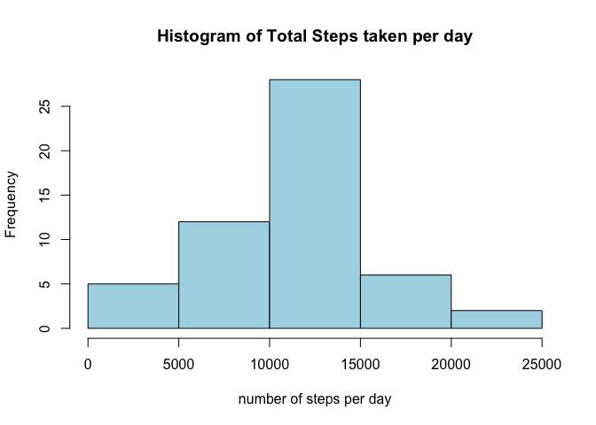
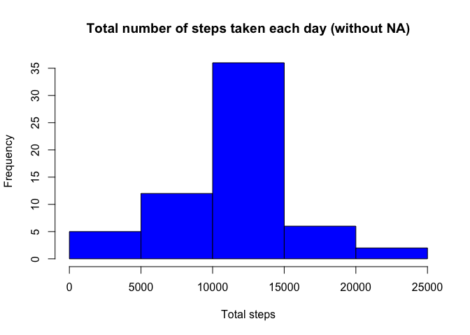

# Reproducible Research: Personal Activity Monitoring
###   $$Reproducible Research - Project 1$$


```r
library(dplyr)
library(ggplot2)
library(lattice)
```
## Loading and preprocessing the data


```r
fileName <- "https://d396qusza40orc.cloudfront.net/repdata%2Fdata%2Factivity.zip"
download.file(fileName, dest="dataset.zip", mode="wb") 
unzip ("dataset.zip", exdir = "./")
act_data <- read.csv("activity.csv")
act_data$date <- as.Date(act_data$date,"%Y-%m-%d")
```


## What is mean total number of steps taken per day?

```r
stepsPerDay <- tapply(act_data$steps, act_data$date,sum)
```

mean and medium Number of Steps Taken Per Day

```r
mean(stepsPerDay,na.rm = TRUE)
```

```
## [1] 10766.19
```

```r
median(stepsPerDay,na.rm = TRUE)
```

```
## [1] 10765
```
The mean and median of total number of steps taken per day are 10766.19 and 10765 respectively.

###Histogram of total number of steps taken per day

```r
hist(stepsPerDay, xlab="number of steps per day", main="Histogram of Total Steps taken per day", col="light blue")
```



## What is the average daily activity pattern?

```r
stepsIntervals <- aggregate(act_data$steps, by=list(act_data$interval), mean, na.rm=TRUE, na.action=NULL)
names(stepsIntervals)[1] <- "interval"
names(stepsIntervals)[2] <- "mean.steps"
plot(stepsIntervals$interval, stepsIntervals$mean.steps, type = "n", main = "Average number of steps at 5 minute Intervals", xlab = "5-minute intervals", ylab = "Average number of steps") 
lines(stepsIntervals$interval,stepsIntervals$mean.steps,type = "l")
abline(v=stepsIntervals[which.max(stepsIntervals$mean.steps), 1], col="blue", lwd=3)
```


```r
stepsIntervals[which.max(stepsIntervals$mean.steps), 1]
```

```
## [1] 835
```

```r
num_na_values <- sum(is.na(act_data))
```


## Imputing missing values

```r
act_data_miss <- merge(act_data, stepsIntervals, by = "interval", sort= FALSE)
act_data_miss$steps[is.na(act_data_miss$steps)] <- act_data_miss$mean.steps[is.na(act_data_miss$steps)]
missing_data.nona <- act_data_miss[, c(2,3,1)]
acd_data_new <- aggregate(missing_data.nona$steps, by=list(missing_data.nona$date), sum)
names(acd_data_new)[1] <-"day"
names(acd_data_new)[2] <-"steps"
hist(acd_data_new$steps, col = "blue", main = "Total number of steps taken each day (without NA)",xlab = "Total steps")
```



```r
mean(acd_data_new$steps)
```

```
## [1] 10766.19
```

```r
median(acd_data_new$steps)
```

```
## [1] 10766.19
```
The new mean and median of total number of steps taken per day are 10766 and 10766 respectively, the median is exactly equal to the mean. Because of the strategy chosen, there is no impact of imputing missing data on the estimates of the mean daily number of steps.

## Are there differences in activity patterns between weekdays and weekends?

```r
days <- weekdays(act_data$date)
act_data$day_type <- ifelse(days == "Saturday" | days == "Sunday", "Weekend", "Weekday")
mean_steps_by_interval <- aggregate(act_data$steps,by=list(act_data$interval,act_data$day_type),na.rm=TRUE, na.action=NUL, FUN = "mean")
names(mean_steps_by_interval) <- c("interval","day_type","steps")
xyplot(steps~interval | day_type, mean_steps_by_interval,type="l",layout=c(1,2),xlab="Interval",ylab = "Number of steps")
```


```r
tapply(mean_steps_by_interval$steps,mean_steps_by_interval$day_type,function (x) { c(MINIMUM=min(x),MEAN=mean(x), MEDIAN=median(x),MAXIMUM=max(x))})
```

```
## $Weekday
##   MINIMUM      MEAN    MEDIAN   MAXIMUM 
##   0.00000  35.33796  23.97436 234.10256 
## 
## $Weekend
##   MINIMUM      MEAN    MEDIAN   MAXIMUM 
##   0.00000  43.07837  32.03571 175.00000
```
The mean of the weekend is high than the mean during the week! 
